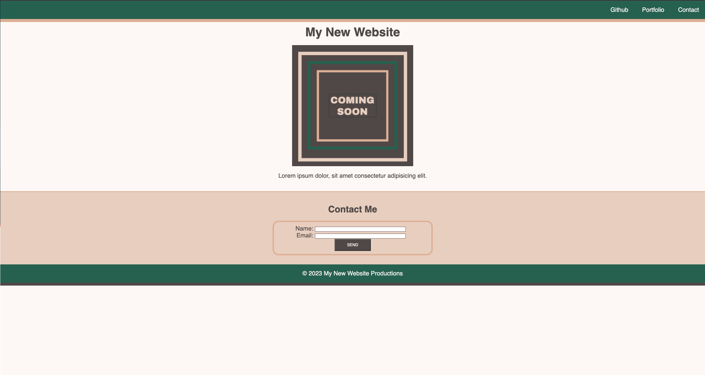

# Landing Page

## Description

This Landing Page was implemented as a way for a client to have single webpage that collects a visitor's contact information with a polished and accessible UI. 

## Installation

N/A

## Usage
Landing Page Link: https://itzelherndz.github.io/landing-page/

This Landing Page can be used accessing the the navigation bar found in the header of the page. In the navigation bar are three items: GitHub, Portfolio, and Contact. 
* When GitHub is clicked, user is taken to Itzel Hernandez's GitHub page.
* When Portfolio is clicked, user is not taken anywhere. (Portfolio not yet developed)
* When Contact is clicked, user is taken to the contact form on the Landing Page. 

The following is the screenshot of the webpage:

## Credits

This webpage was modeled after the sample page provided by the UTSA Coding Bootcamp:

## License

Please refer to the LICENSE file in the repository.

## Project Status

Landing Page is currently being personalized. It will later include JavaScript for the contact form to be functional.
